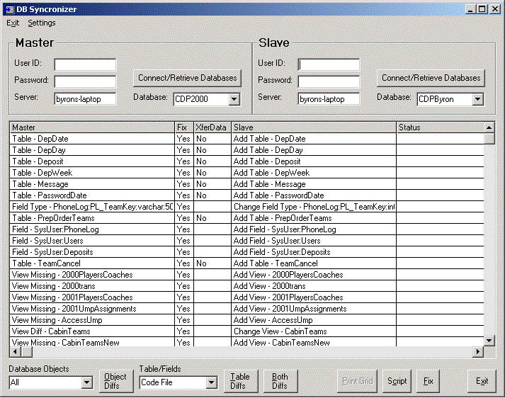



## Database Synchronizer

### Description

This software lists the differences in tables, fields, indexes, stored procedures, views, constraints, keys, and triggers, between two databases. You can specify one to be a master and one a slave, then synchronize the slave to the master (using the SQLDMO), or create a SQL script to do the synch. You can toggle whether to "Fix" a difference or Xfer data by clicking on that cell. You can double-click on the "Slave" cell to run Windiff and view the difference between the SQL creation scripts.
 
### More Info
 
Database server name, user name, and password

In order to use the view the differences between the SQL creation scripts for a particular item, you will need to make sure the files Windiff.exe and GUTILS.DLL are copied to your App.Path.

The software currently cannot change a field's datatype, and the Bulk Copy option for data is buggy. There is the framework for being able to diff data in two tables, but it is specific to the task I was working on.

             |
---                |---
**Submitted On**   |2001-08-13 10:32:50
**By**             |[Byron Richard](https://github.com/Planet-Source-Code/PSCIndex/blob/master/ByAuthor/byron-richard.md)
**Level**          |Intermediate
**User Rating**    |5.0 (80 globes from 16 users)
**Compatibility**  |VB 6\.0
**Category**       |[Complete Applications](https://github.com/Planet-Source-Code/PSCIndex/blob/master/ByCategory/complete-applications__1-27.md)
**World**          |[Visual Basic](https://github.com/Planet-Source-Code/PSCIndex/blob/master/ByWorld/visual-basic.md)
**Archive File**   |[Database S245768132001\.zip](https://github.com/Planet-Source-Code/byron-richard-database-synchronizer__1-26150/archive/master.zip)

